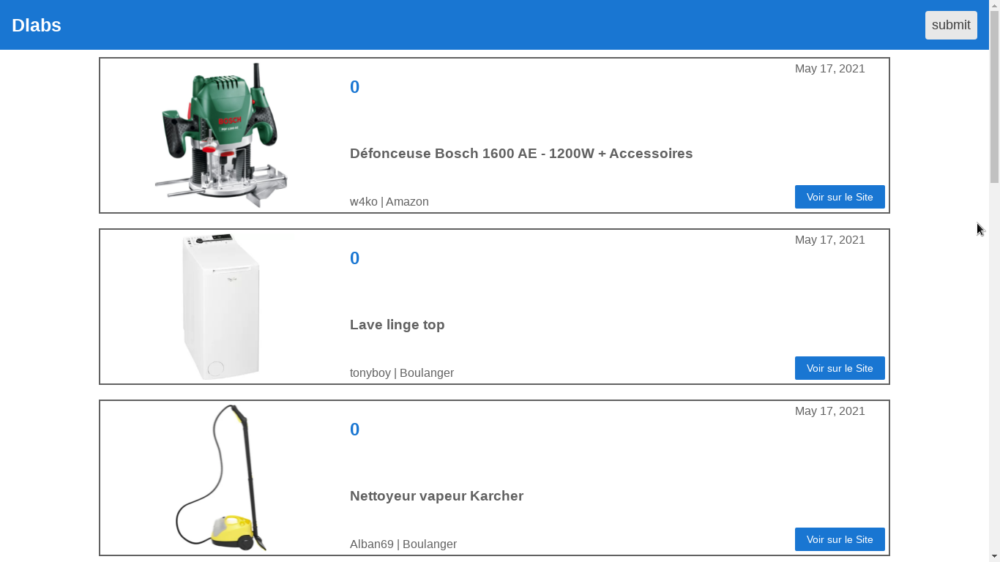
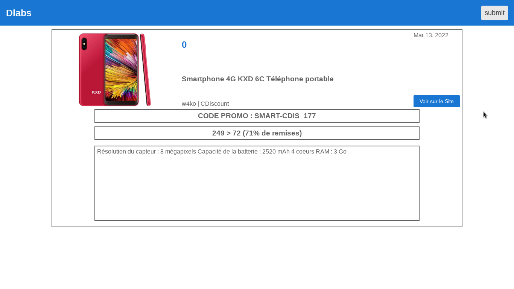
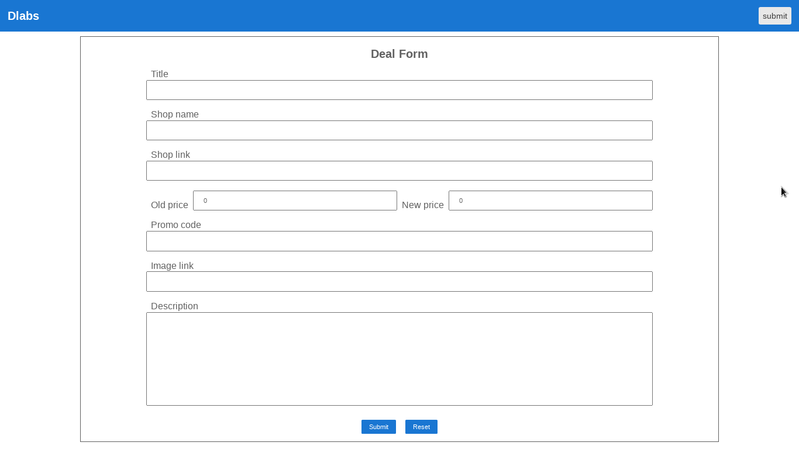

# Dlabs (Front: Angular)

## Description

L'application est un site web consommant l'API fournit par le serveur Spring.

### Dérouler

Dans un navigateur web, aller à l'adresse:
```
localhost:4200
```

L'utilisateur est redirigé vers une page listant tout les deals disponibles.
* Lorsque l'utilisateur clique sur le nom d'un deal il est redirigé vers une page détaillé de celui-ci.
* Lorsque l'utilisateur clique sur le bouton 'Aller sur le site' l'utilisateur est redirigé vers le site commercant proposant le deal.
* Lorsque l'utilisateur clique sur le titre de l'application (en haut à gauche) il retourne sur la liste des deal.
* Lorsque l'utilisateur clique sur le bouton 'submit' il est redirigé vers un formulaire pour inscrire un deal.

### Images





### Fonctionnalitées

#### Fait

* Service d'accès à l'API REST
* Création d'une page principale (Homepage) regroupant une liste synthétique de tout les produits
* Création d'une page détaillée individuelle pour chaque produit
* Création d'une page de formulaire pour poster un produit

#### En cours

* Création d'une page de connexion/inscription pour l'utilisateur

#### À faire / Souhaitées (Idées)

* Uniquement les utilisateurs enregistrés peuvent soumettre des deals
* Un utilisateur peut avoir accès à une liste regroupant les deals qu'il a soumis
* Un utilisateur peut modifier les deals qu'il a soumis

## Utilisation

### Installation

Installation de Node:
```
$ wget -qO- https://deb.nodesource.com/setup_14.x | sudo -E bash -
$ sudo apt install -y nodejs
```

Installation de Angular:
```
$ npm install -g @angular/cli
```

### Lancement (run)
```
$ cd front_angular/
$ ng serve
```

### À savoir

[tutoriel Angular 'Getting Started'](https://angular.io/start)

[tutoriel Angular 'Tour of Heroes'](https://angular.io/tutorial)